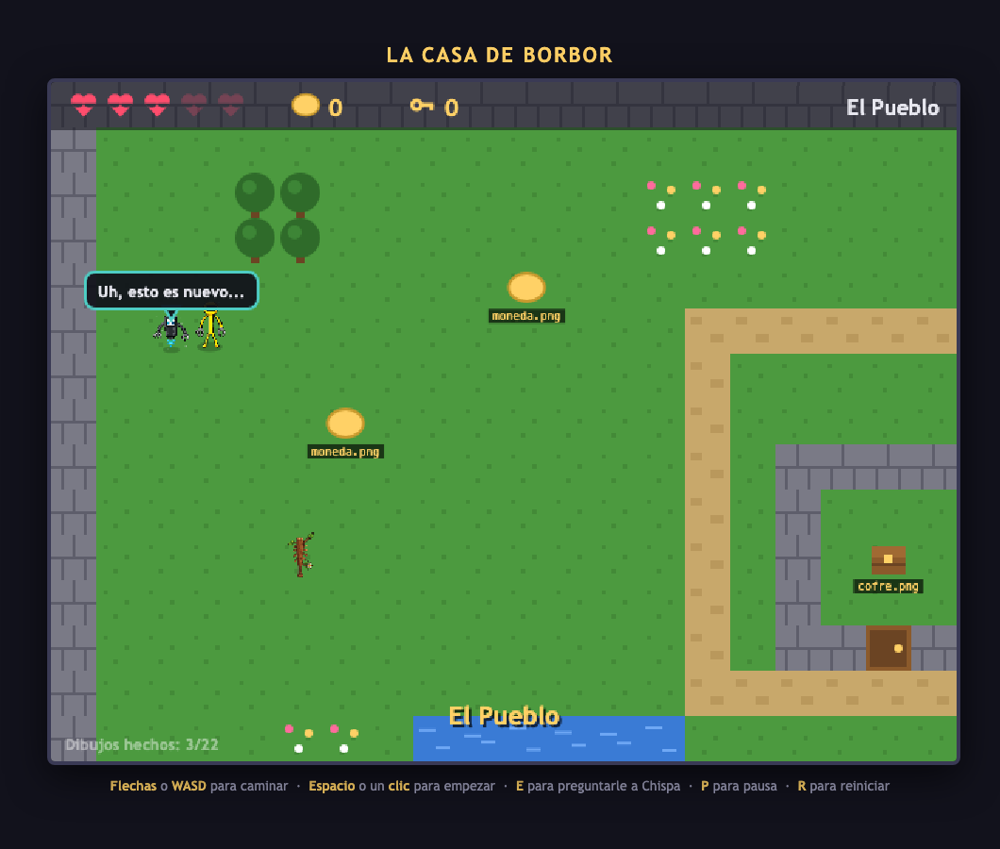

# 🗡️ La Casa de BorBor

Un videojuego de aventura **hecho por un chico de 10 años y su papá**.

Y, sobre todo, un proyecto para **aprender a programar haciendo un juego de verdad**:
con enemigos, mapas, colisiones, animación y una IA que te acompaña.

### ▶️ [Jugar ahora](https://gabopuertas.github.io/la-casa-de-borbor/)

**Anda en la compu y también en celular y tablet**, con palanca y botones en pantalla.



*Los carteles amarillos no son un error: son la lista de tareas. Marcan qué dibujo
todavía falta, y van desapareciendo a medida que se dibujan.*

---

## La idea

El juego **está completo y funciona**: 3 mapas, dos tipos de enemigo, llaves,
puertas, cofres, un arma, un amigo con IA, sonido, victoria y derrota.

Pero **arranca sin ninguna imagen**. Todo lo que se ve está dibujado con código:
círculos, rectángulos y algo de trigonometría.

Eso no es una limitación — es el diseño:

- El juego **nunca se rompe** por un archivo que falta. Un chico no puede quedar trabado.
- Cada PNG que agrega **reemplaza** una figura de relleno, y se ve al instante.
- La portada lleva el marcador: `Tus dibujos en el juego: 3 de 22`.
- Y deja clarísima la lección más importante: **el dibujo y la lógica son
  cosas separadas**. El juego no ve dibujos: ve rectángulos con números.

---

## Para jugarlo o usarlo

**Jugar:** entrá a [gabopuertas.github.io/la-casa-de-borbor](https://gabopuertas.github.io/la-casa-de-borbor/)

**Usarlo con tus hijos o tus alumnos:**

1. Descargá el ZIP (botón verde **Code → Download ZIP**) o cloná el repo
2. **Doble clic en `index.html`**

Eso es todo. **Sin instalar nada, sin terminal, sin npm, sin build.**
HTML + CSS + JavaScript plano. Anda offline.

> Tampoco usa módulos ES6 ni frameworks, **a propósito**: los módulos no funcionan
> abriendo un archivo con doble clic. Menos elegante para un profesional,
> infinitamente más fácil para un chico. Si algo no carga, hay un `servidor.command`
> que levanta un servidor local.

---

## Qué se aprende (y en qué orden)

Las guías están en español, escritas para leerlas a los 10 años, en `guia/`:

| Guía | Qué enseña |
|---|---|
| [00 — Empezá acá](guia/00-empezar-aca.md) | **Termina programando de verdad en 10 minutos** |
| [01 — Cómo funciona un videojuego](guia/01-como-funciona-un-videojuego.md) | El game loop, delta time, por qué la Y va al revés |
| [02 — Las partes del juego](guia/02-las-partes-del-juego.md) | Separar responsabilidades, orden de dibujado, la cámara |
| [03 — Tus dibujos](guia/03-tus-dibujos.md) | Dibujo → juego. Por qué PNG y no JPG (el canal alfa) |
| [04 — Hacer mapas](guia/04-hacer-mapas.md) | Mapas ASCII **y diseño de niveles** |
| [05 — Misiones](guia/05-misiones.md) | 12 desafíos, de cambiar un número a programar un enemigo |
| [06 — Animación](guia/06-animacion.md) | Por cuadros y procedural: seno, coseno y una sombra |
| [07 — El amigo](guia/07-el-amigo.md) | **Cómo funciona una IA de videojuego, de verdad** |
| [08 — Celulares](guia/08-celulares.md) | El patrón adaptador y el diseño adaptable |
| [Glosario](guia/glosario.md) | Sprite, tile, AABB, hitbox, i-frames, culling, flood fill… |

---

## 🤖 Chispa: una IA que se puede leer entera

El amigo que te acompaña **no es un chatbot ni un modelo de lenguaje**.
Es el ciclo que usan todas las IA de videojuegos, escrito para que un chico
lo pueda leer y cambiar:

```
 PERCIBIR  →  RECORDAR  →  DECIDIR  →  ACTUAR
percepcion.js  memoria.js  decision.js  amigo.js
```

- **Percibir** — arma un resumen del mundo en números (distancias en casillas, no en píxeles)
- **Recordar** — compara la foto de ahora con la anterior. Así **deduce** cosas que
  no existen en ningún lado del juego, como *"te lastimaron"*
- **Decidir** — **IA por utilidad**: cada idea se pone una nota de urgencia y gana
  la más alta. `peligro` vale 100, `charla` vale 5. Es lo que usan Los Sims.
- **Actuar** — seguir, huir o señalar

Piensa **6 veces por segundo**, no 60: el mundo no cambia tanto en 16 milésimas.

Y `cerebro.js` es **un enchufe**: el cuerpo solo pregunta
`Cerebro.pensar(percepción, memoria) → { acción, frase }`.
Mientras se cumpla ese contrato, adentro puede haber una lista de reglas
o un modelo de IA. La plantilla para conectar un LLM está incluida y explicada
(apagada, porque una clave de API no puede vivir en una página web).

---

## 🎨 El taller de sprites

`taller/recortar.html` convierte **la foto de un dibujo en papel** — o una imagen
generada con IA — en un sprite con fondo transparente:

- Traé la imagen arrastrándola, con `Ctrl+V` o con el botón
- **Varita mágica** (flood fill con tolerancia) y botón de *sacar el fondo solo*
- Goma, deshacer, y ajuste automático de bordes
- Exporta a 32/48/64/96 px, centrado y sin deformar
- **Menú con los 22 nombres exactos** que el juego espera, y en qué carpeta va cada uno

Y `taller/prompts-ia.md` explica cómo pedirle sprites a una IA que sirvan de verdad
(vista desde arriba, fondo liso, contorno grueso, y **tileable** para los pisos).

---

## 📱 En el celular

El juego se hizo con teclado, pero funciona igual en pantallas táctiles:

- **Palanca** a la izquierda y botones a la derecha, que aparecen solos cuando
  detectan una pantalla táctil (o con `?tactil=1` para probarlos desde la compu)
- En el celular **parado**, el juego **cambia de forma**: pasa de 640×480 a 480×640
  para aprovechar la pantalla en vez de quedar en una franjita
- **Acostado**, los controles se ponen encima del juego y se oculta todo lo demás
- Sin zoom accidental, sin "tirar para refrescar" y sin quedarse caminando solo al girar

Por dentro, los controles táctiles **fingen ser teclas**: escriben en la misma lista
donde escribe el teclado. El jugador, los enemigos y Chispa no se enteran de que
existe una pantalla táctil. Eso es el **patrón adaptador**.

---

## Estructura

```
index.html            el esqueleto — doble clic para jugar
css/estilo.css        la ropa
js/                   el cerebro, un archivo por responsabilidad
  config.js           ← todos los números que se pueden tocar
  amigo/              ← la IA de Chispa, en 5 pedazos
  tactil.js           ← los dedos, fingiendo ser teclas
imagenes/             los dibujos
taller/               la herramienta de sprites
guia/                 las 9 guías
```

Todo el código está comentado **en español y para que lo lea un chico**.

---

## Créditos

- **Juego, arte y diseño:** BorBor, 10 años (dibujos hechos con ayuda de IA)
- **Código y guías:** escritos junto a [Claude Code](https://claude.com/claude-code)

Licencia [MIT](LICENSE) — usalo, copialo, cambialo y compartilo.
Si lo usás con tus hijos o en una escuela, nos encantaría saberlo.
